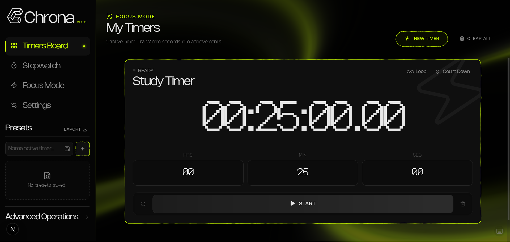
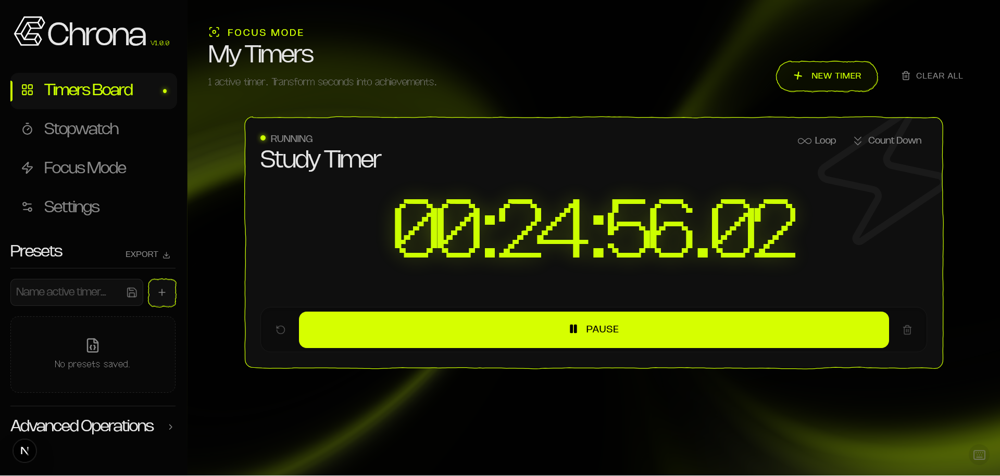
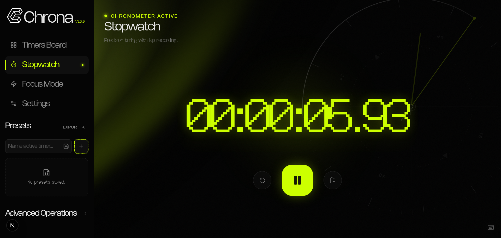
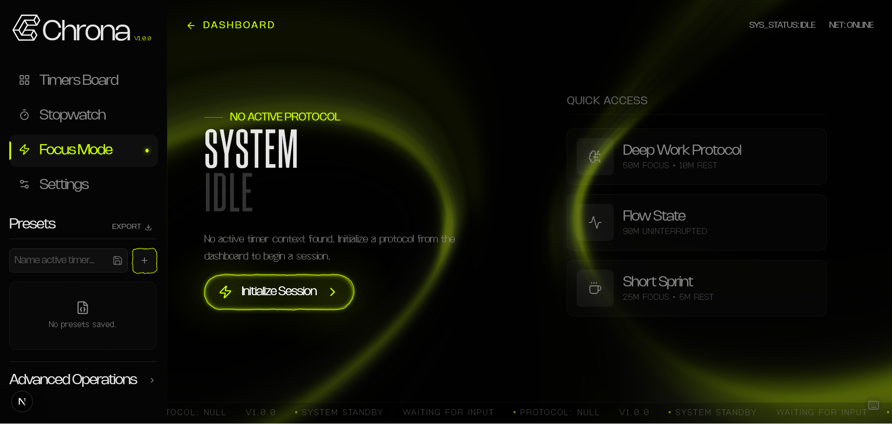
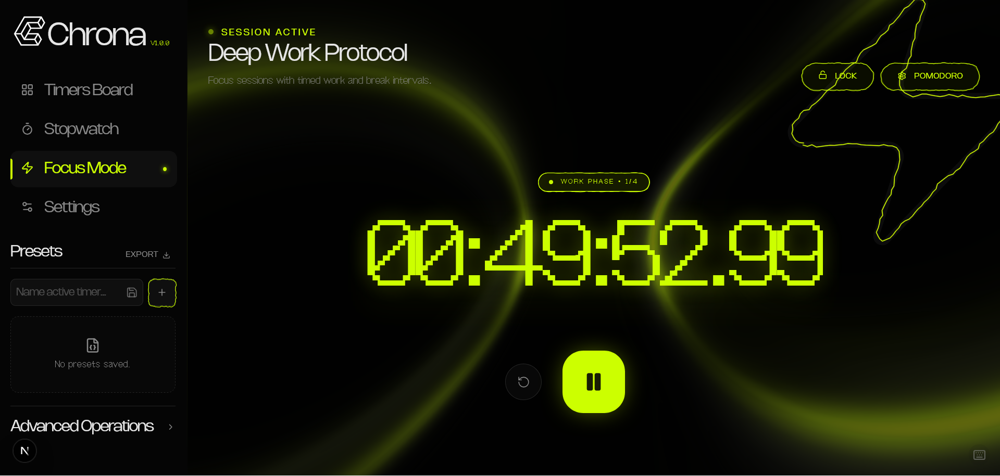
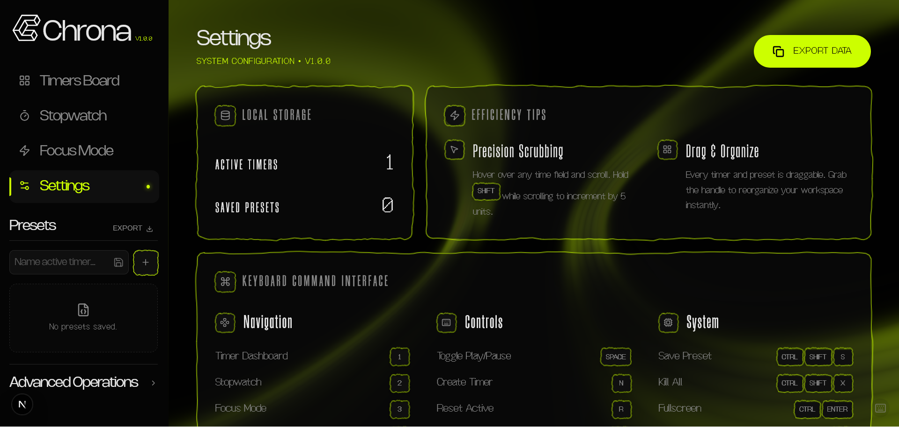

# Chrona Desktop


Precision-first, distraction-free desktop timer for power users. Built for focus sessions, rapid multi-timer workflows, and ultra-accurate timing.

**Portfolio Showcase** — Chrona highlights my product design, UI engineering, and systems thinking across precision timing, animation, and keyboard-first UX.

**Live Demo:** https://your-vercel-domain.vercel.app

## 📸 Screens

> Add screenshots to `public/screenshots/` and update the paths below.








## ✨ Highlights

- High-precision timer engine with drift correction and Web Worker architecture.
- Multi-timer dashboard with parallel execution and color-coded status indicators.
- Pomodoro focus system with auto-start rules and cycle tracking.
- Focus lock mode with full-screen immersive experience.
- Presets system with import/export and quick launch.
- Keyboard-first workflows with comprehensive shortcuts.

## 🧰 Tech Stack

- Next.js (App Router)
- TypeScript
- Tailwind CSS
- Zustand
- GSAP
- Radix UI
- Lucide React

## 🚀 Getting Started

Install dependencies:

```bash
npm install
```

Run the development server:

```bash
npm run dev
```

Open [http://localhost:3000](http://localhost:3000) with your browser to see the app.

## 📦 Scripts

```bash
npm run dev
npm run build
npm run start
npm run lint
```

## ☁️ Deployment (Portfolio)

Chrona is deployed online to showcase the full experience in a shareable, production-ready environment. This lets anyone explore the UI, animations, and workflow without local setup.

### Environment Variables

If you add third-party services, document them here. Example format:

```bash
# Analytics (example)
NEXT_PUBLIC_ANALYTICS_ID=

# Notifications (example)
NEXT_PUBLIC_NOTIFICATIONS_PUBLIC_KEY=
```

## 🧭 Feature Roadmap

For full feature details and planned work, see [FEATURE_DOCUMENTATION.md](FEATURE_DOCUMENTATION.md).
